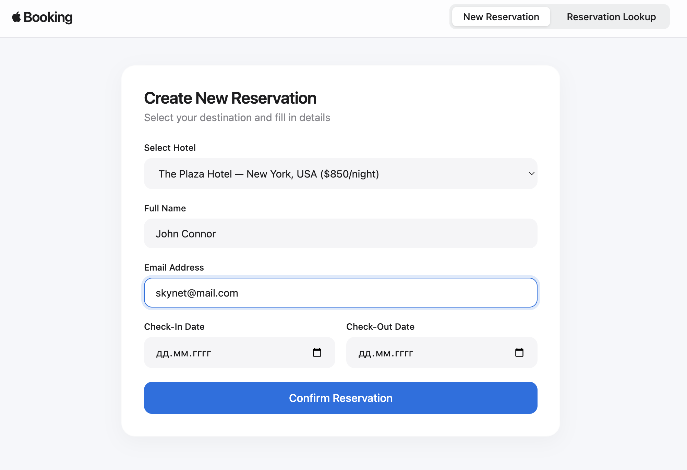
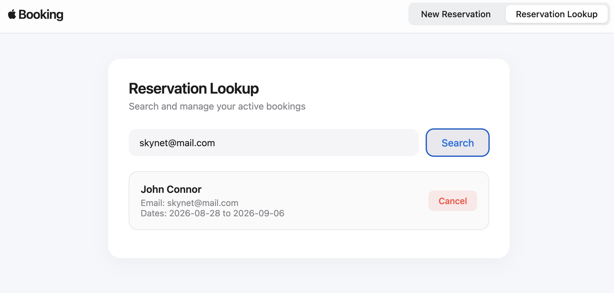

# Booking System — Frontend Client

Modern, responsive Single Page Application (SPA) built with vanilla JavaScript and CSS, designed to interact with the backend API dynamically.

## 🚀 Features
- Dynamic configuration loading (`config.json`) for seamless DevOps/Environment switching or passing ENV API_URL=<your url> for overriding the backend API server.
- Hotel selection dropdown with interactive descriptions.
- Reservation creation and lookup/cancellation dashboard.

## 🐳 Docker Build
To build the frontend image manually:
```bash
docker build -t dimakhot/frontend-py3-app:latest .

- **The server run on port:** 3000




